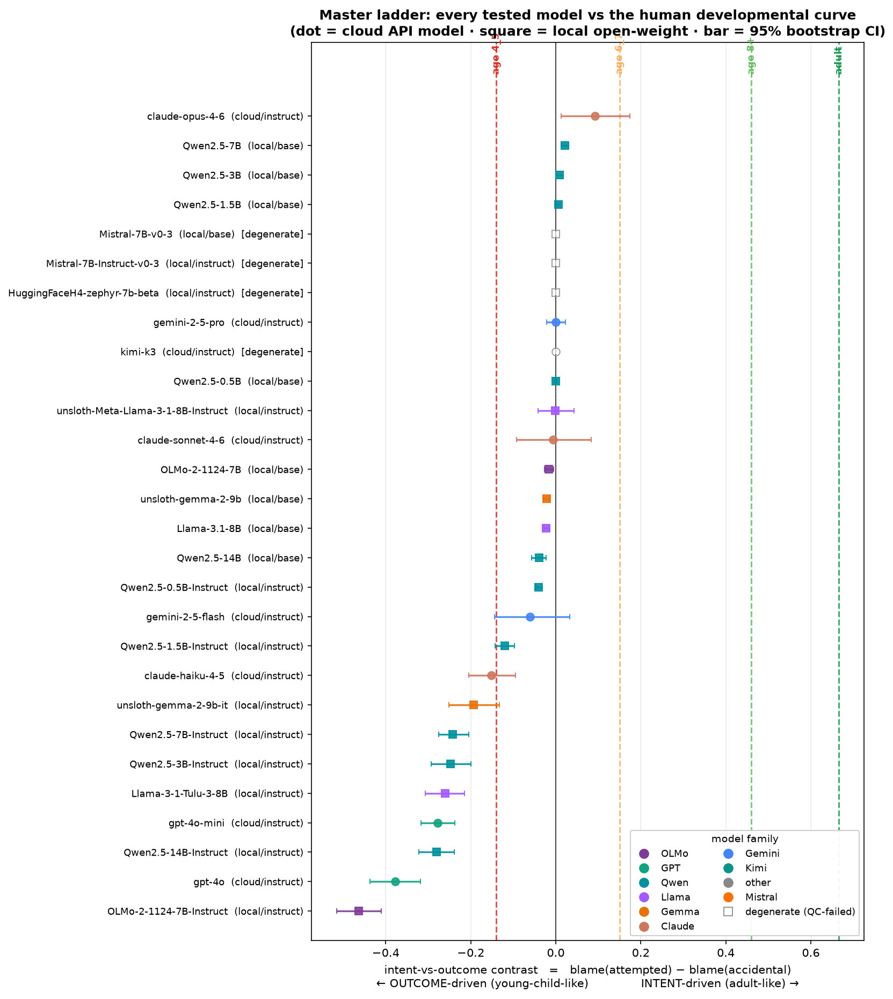

# Master Summary — Intent vs. Outcome in LLM Moral Judgment

*Do large language models judge moral scenarios like adults (by an agent's **intent**) or like young children (by the **outcome**)? And does model scale move them up the human developmental curve?*

Last updated: 2026-07-08

---

## 1. The question and the metric

Every model reads a short moral vignette and rates how blameworthy the main character is. The stimuli are a **2×2 factorial** crossing the character's **intent** (innocent vs. guilty belief) with the **outcome** (no harm vs. harm), yielding four conditions:

| condition | intent | outcome | plain meaning |
|---|---|---|---|
| **neutral** | innocent | no harm | did nothing wrong |
| **accidental** | innocent | harm | "meant well, bad luck" |
| **attempted** | guilty | no harm | "tried to harm, failed" |
| **intentional** | guilty | harm | fully culpable |

All ratings are normalized to a common **0–1 blame scale**. The headline metric is the

> **intent-vs-outcome contrast = blame(attempted) − blame(accidental)**

- **Positive** → the judge blames bad *intent* more than bad *outcome* → **adult-like**.
- **Negative** → bad *outcome* drives blame → **young-child-like**.

This single number places any judge on a human developmental ladder.

---

## 2. Human reference (the developmental ladder)

Derived from the published developmental literature (adults: Young, Cushman, Hauser & Saxe 2007 PNAS; children: Cushman, Sheketoff, Wharton & Carey 2013 Cognition):

| group | contrast | interpretation |
|---|---|---|
| **adult** | **+0.67** | strongly intent-weighted |
| **child_8plus** | +0.46 | mostly intent-weighted |
| **child_6_7** | +0.15 | transitioning |
| **child_4_5** | **−0.14** | outcome-weighted |

Adults weigh intent heavily; 4–5-year-olds actually blame *accidental* harm **more** than *attempted* harm. This is the curve every model is scored against.

---

## 3. What was tested

Two **independent** pipelines share the same 298-item stimulus set, prompts, and scoring, but cover different model classes:

| Study | Models | Access | Scoring | Status |
|---|---|---|---|---|
| **Cloud "daily-agent"** | Claude (Haiku-4.5, Sonnet-4.6, Opus-4.6), Gemini (2.5-Flash, 2.5-Pro), **GPT (4o-mini, 4o)** | closed API | sampling, T=0 | **done** |
| **Local open-weight** | Qwen2.5 ladder (0.5B→14B, base+instruct), Llama-3.1-8B, Llama-3.2-3B, Mistral-7B-v0.3, OLMo-2-7B, Gemma-2-9B, Phi-3-mini | HuggingFace forward pass | deterministic logprob | **done** |

**Tested: 21 unique models** across 7 families + the human ladder. *(GPT-4o and GPT-4o-mini were run on 2026-07-08 once OpenAI billing cleared; they are now included in all analyses below.)*

### Not yet tested / pending

| Item | Reason | Ready to run? |
|---|---|---|
| **GPT-4-turbo** | Only gpt-4o-mini and gpt-4o were run; gpt-4-turbo still pending | Yes — add to the OpenAI block in `engaging/run_agents.sh` + submit |
| Per-item matched human ratings on the *exact* stimuli | Need Saxe-lab raw data | Blocked on external request |
| Representation track (Levels 2–3: activation probes, rep↔behavior link) | GPU forward-pass on open-weight only; not yet executed for this write-up | Scaffolded in `01_extract_activations.py`, `02_probe.py`, `04_link_analysis.py` |
| Full 7-template prompt sweep | Only 3 of 7 templates run so far | Yes — pass all templates to `03_behavioral.py` |
| Meta-Llama via Together API | Not needed — Llama already covered in the local open-weight study | N/A |

---

## 4. Prompts used

Ratings were collected under the **exact scale from each source paper** (`human_verbatim`) plus paraphrases, so we can check the result is not a wording artifact. The three templates in the current diagnostic set:

| template id | prompt (verbatim) | scale |
|---|---|---|
| **human_verbatim** | Source-paper scale, auto-selected per stimulus: permissibility "How permissible was {agent}'s action? 1 (completely permissible)–3 (completely impermissible)"; blame "How much blame does {agent} deserve? 1 (no blame)–4 (full blame)"; wrongness "How morally wrong was {agent}'s action? 1 (not at all wrong)–7 (extremely wrong)" | 1–3 / 1–4 / 1–7 |
| **para_wrong7** | "How morally wrong was the agent's action? Rate 1 (not wrong) to 7 (extremely wrong). Single integer only." | 1–7 |
| **punish7** | "How severely should the agent be punished? Rate 1–7. Single integer only." | 1–7 |

Additional paraphrases exist in the code (`para_blame10`, `para_blame4`, `acceptable7`, `persona_adult7`) for a future full 7-template robustness sweep.

**Scoring:** open-weight models use deterministic **logprob** scoring (rating = expected value over the model's own token distribution, `E[rating]=Σ p(k)·k`, zero sampling noise). Closed APIs (no logits exposed) use **sampling** at temperature 0.

---

## 5. Headline results



**Combined ranking (cloud + local), sorted most adult-like → most child-like:**

| model | family | study | contrast [95% CI] | ≠0? | nearest human |
|---|---|---|---|---|---|
| **claude-opus-4-6** | Claude | cloud | **+0.09 [+0.01, +0.17]** | yes | child_6_7 |
| Qwen2.5-7B (base) | Qwen | local | +0.02 [+0.01, +0.03] | yes | child_6_7 |
| Qwen2.5-3B (base) | Qwen | local | +0.01 [0.00, +0.02] | yes | child_6_7 |
| gemini-2.5-pro | Gemini | cloud | −0.00 [−0.02, +0.02] | no | child_4_5 |
| claude-sonnet-4-6 | Claude | cloud | −0.01 [−0.09, +0.08] | no | child_4_5 |
| Llama-3.1-8B (base) | Llama | local | −0.02 [−0.03, −0.02] | yes | child_4_5 |
| gemini-2.5-flash | Gemini | cloud | −0.06 [−0.14, +0.03] | no | child_4_5 |
| **claude-haiku-4-5** | Claude | cloud | **−0.15 [−0.21, −0.09]** | yes | child_4_5 |
| Qwen2.5-7B-**Instruct** | Qwen | local | −0.24 [−0.28, −0.21] | yes | child_4_5 |
| Qwen2.5-14B-**Instruct** | Qwen | local | −0.28 [−0.32, −0.24] | yes | child_4_5 |
| **gpt-4o-mini** | GPT | cloud | **−0.28 [−0.32, −0.24]** | yes | child_4_5 |
| **gpt-4o** | GPT | cloud | **−0.38 [−0.44, −0.32]** | yes | child_4_5 |

*(Full 21-model table in `master_all_models.csv`.)*

### Key findings

1. **No model reaches even the 8-year-old level (+0.46), let alone adult (+0.67).** The single best judge, Claude Opus 4.6, sits at +0.09 — around the **6–7-year-old** band. Every other model is at or below the 6–7 line, most clustered near the **4–5-year-old** floor. **LLMs are systematically outcome-biased relative to adult humans.**

2. **The most capable cloud models are the *most* outcome-biased.** GPT-4o (−0.38) and GPT-4o-mini (−0.28) are the most child-like judges in the entire set — *more* outcome-driven than any Claude/Gemini model and than most small open-weight models. Capability/scale clearly does not equal moral maturity here.

3. **Scale does *not* buy adult-like judgment (now quantified).** Across models with disclosed sizes, size↔contrast correlation is **Spearman ρ = −0.23 (p = 0.43)** — if anything slightly *negative*. See `analysis/scale_vs_performance.png`.

4. **Instruction-tuning pushes models *away* from intent-weighting (now a formal test).** Every Qwen base→instruct pair moves in the outcome-biased direction; paired test across the ladder is significant (see §6.2).

5. **Adult *profile* correlation is high even when the contrast is wrong.** Claude Opus correlates r=0.87 with the adult 4-cell profile despite a large contrast gap — models reproduce the *shape* (intentional > neutral) but compress the crucial attempted-vs-accidental distinction.

---

## 6. Statistical analysis

### 6.1 Core inference (both studies)
- **Significance vs. 0:** bootstrap 95% CIs over scenarios. Claude Opus (+), Claude Haiku (−), both GPT models (−), and most Qwen models are reliably non-zero; Gemini Pro/Flash and Claude Sonnet straddle 0.
- **Pairwise model differences** (`agents/stats/pairwise_model_diffs.csv`): Claude Opus is distinguishable from *all* other cloud models; both GPT models are distinguishable from every Claude/Gemini model and from each other (all CIs exclude 0).

### 6.2 Validation analyses (analysis-only, no new inference)
Five reviewer-hardening analyses were added; scripts are `code/11`–`14` + `export_prompts_docx.py`, outputs in `outputs/analysis/`.

- **2×2 intent×outcome interaction regression** (`analysis/interaction_regression.csv`, script 11). Decomposes blame into `b0 + b_intent·I + b_outcome·O + b_interaction·(I·O)`. The **adult fingerprint** is a large intent effect, small outcome effect, and a *negative* (sub-additive) interaction: human adult `b_intent=+0.90 ≫ b_outcome=+0.23`, interaction `−0.20`. **Claude Opus is the only model where intent dominates** (`b_intent=+0.39 > b_outcome=+0.28`, interaction +0.07); for every other model **outcome dominates** (e.g. GPT-4o `b_intent=+0.22` vs. `b_outcome=+0.58`; Qwen2.5-14B-Instruct +0.23 vs +0.61).
- **Base-vs-instruct paired test** (`analysis/base_vs_instruct_pairs.csv`, script 12). Matched by family+size. **Qwen2.5 ladder (n=5): mean Δ = −0.216, all 5 pairs negative, paired t p=0.020, Wilcoxon p=0.063; pooled scenario-level Δ = −0.216, 95% CI [−0.236, −0.197].** Instruction-tuning reliably increases outcome bias at fixed size — finding #3 is now statistically real.
- **Scale-vs-performance correlation** (`analysis/scale_vs_performance.png/.csv`, script 13). Spearman ρ = −0.23 (p=0.43) on disclosed sizes; no positive scaling trend. Human bands drawn as reference lines.
- **Prompt-invariance decomposition** (`analysis/prompt_invariance_decomposition.png/.csv`, script 14). Verdict per model across the 3 wordings: **robust** = GPT-4o, GPT-4o-mini, Gemini-Flash; **sign-stable but variable** = Claude Opus/Haiku, larger Qwen-Instruct; **FRAGILE (sign flip)** = Gemini-Pro, Claude-Sonnet, and most near-zero small models; **degenerate (no signal)** = Mistral. Models with a large-magnitude contrast (GPT, big Qwen-Instruct, Opus) are the ones whose sign is stable — the effect is real where it is large.

### Data-quality caveats
- **Mistral-7B (base & instruct)** returned degenerate all-identical ratings — a **failed elicitation**, not a real null (now flagged automatically).
- Near-zero-contrast models (Gemini-Pro, Claude-Sonnet, small base models) **flip sign** across prompts; their "≈0" should be read as "no reliable signal," not "balanced."
- Cloud `n_samples=1` at T=0; human child bands are **approximated** from published figures, not per-item matched. Adult values are firmer (Young et al. 2007).

---

## 7. Deliverables (what to share)

| File | What it is |
|---|---|
| `outputs/MASTER_SUMMARY.md` | **This document** |
| `outputs/master_developmental_ladder.png` | One-glance figure: all 21 models on the human ladder |
| `outputs/master_all_models.csv` | Combined machine-readable results (both studies + human refs) |
| `outputs/analysis/interaction_regression.csv` | 2×2 intent×outcome coefficients per model + human refs |
| `outputs/analysis/base_vs_instruct_pairs.csv` | Matched base-vs-instruct paired-test data |
| `outputs/analysis/scale_vs_performance.png` / `.csv` | Size↔contrast figure with Spearman/Pearson |
| `outputs/analysis/prompt_invariance_decomposition.png` / `.csv` | Per-model prompt-stability verdicts |
| `outputs/prompts/ToM_prompts.docx` | All prompt templates (original human-study prompt first) |
| `outputs/agents/report/summary_table.md` | Cloud-study detailed table |
| `outputs/agents/figures/`, `outputs/agents/stats/`, `outputs/stats/` | Per-analysis figures + raw stats CSVs |

---

## 8. Reproduce

```bash
cd ~/tom_project && source .venv/bin/activate
# Core stats + figures (both studies):
python code/06_stats.py --behavior outputs/agents/behavior --out outputs/agents/stats
python code/09_agent_figures.py --behavior outputs/agents/behavior \
       --stats outputs/agents/stats --out outputs/agents/figures
python code/10_master_figure.py                     # combined master figure + CSV

# Validation analyses (analysis-only, no model inference):
python code/11_interaction_regression.py            # 2x2 intent×outcome regression
python code/12_base_vs_instruct_test.py             # base-vs-instruct paired test
python code/13_scale_vs_performance.py              # scale↔contrast correlation figure
python code/14_prompt_invariance_decomposition.py   # prompt-stability decomposition
python code/export_prompts_docx.py                  # regenerate the prompt Word doc
```
