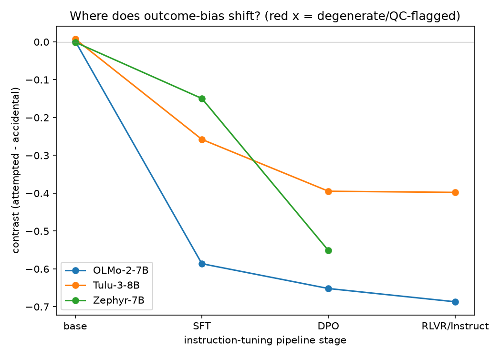
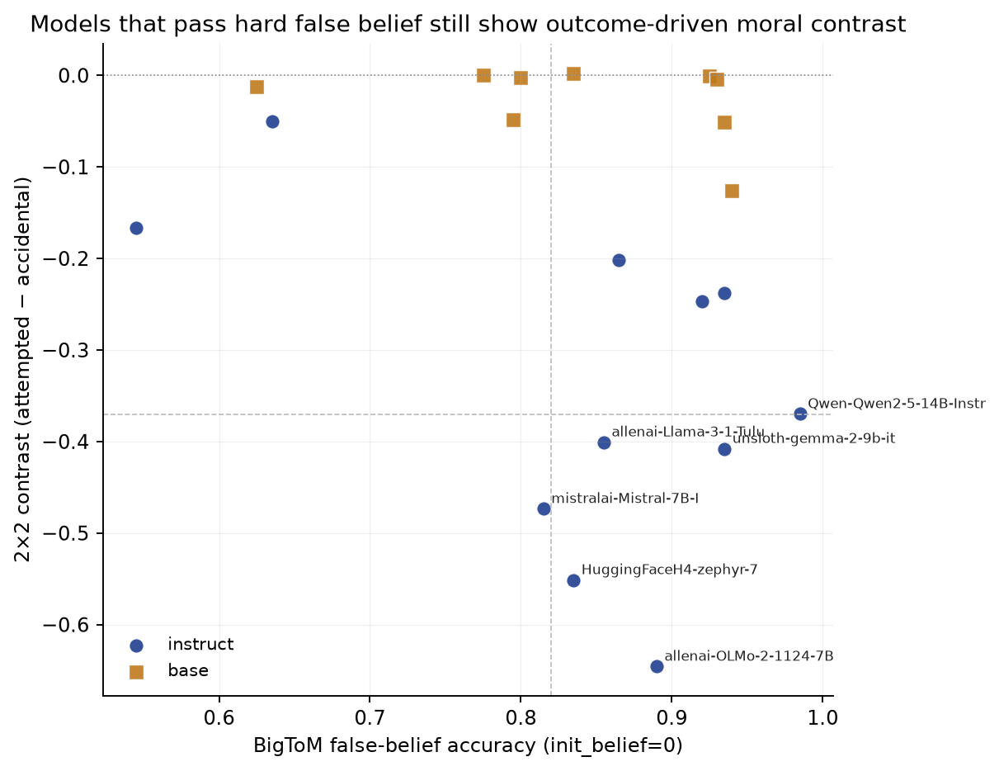
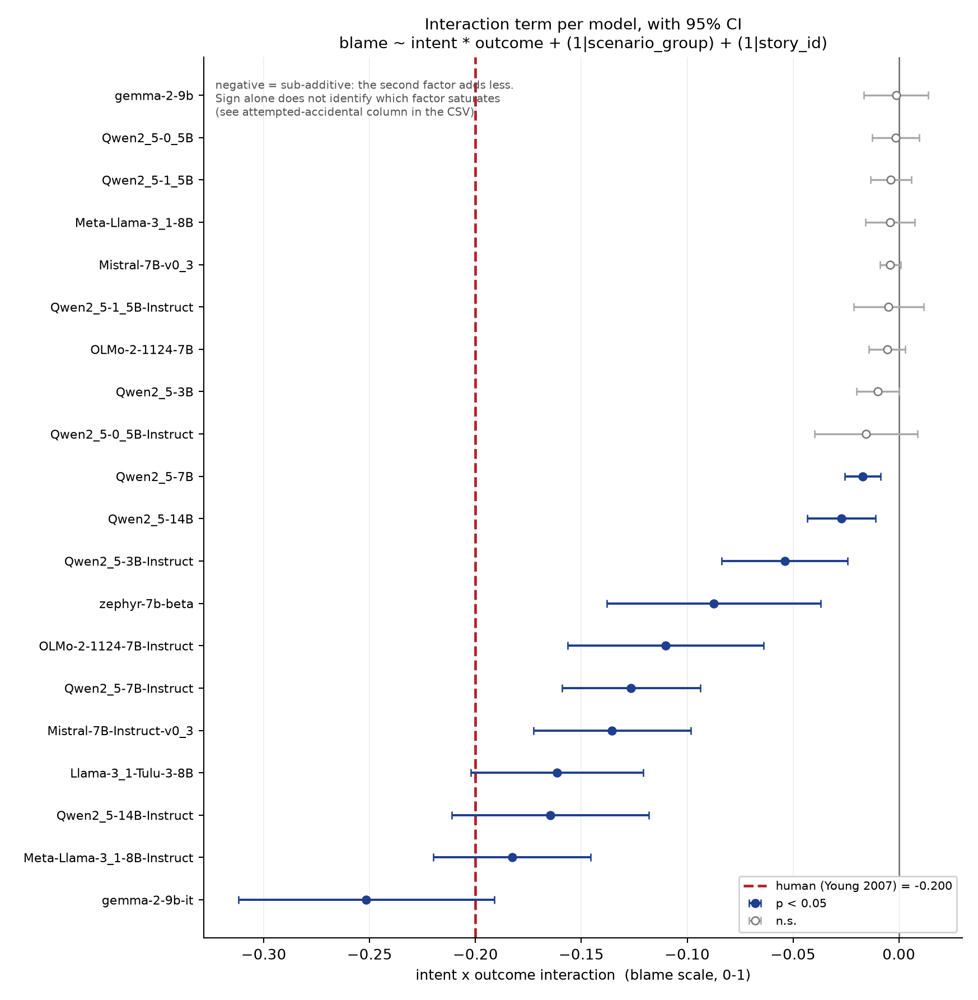
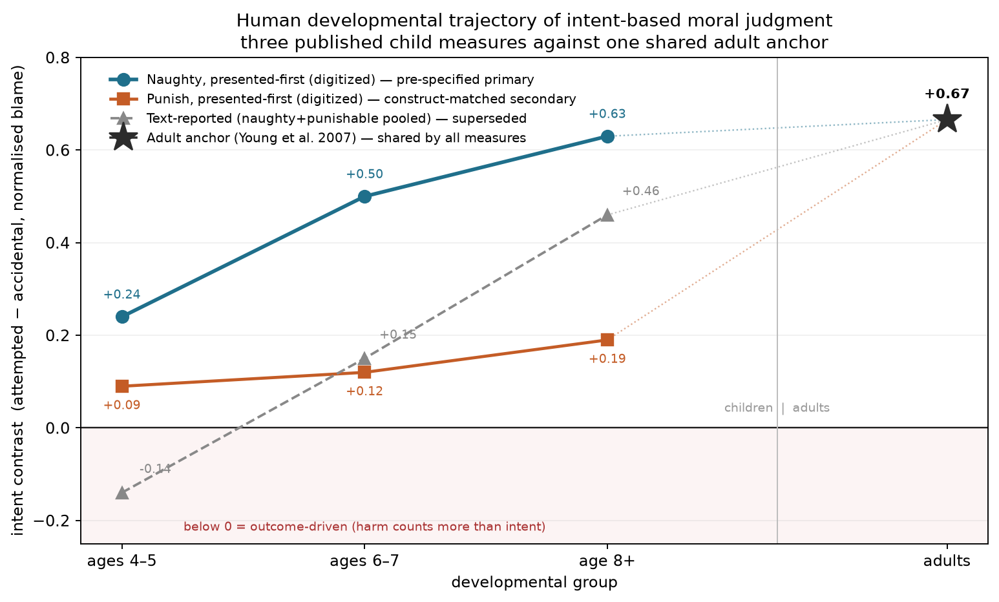
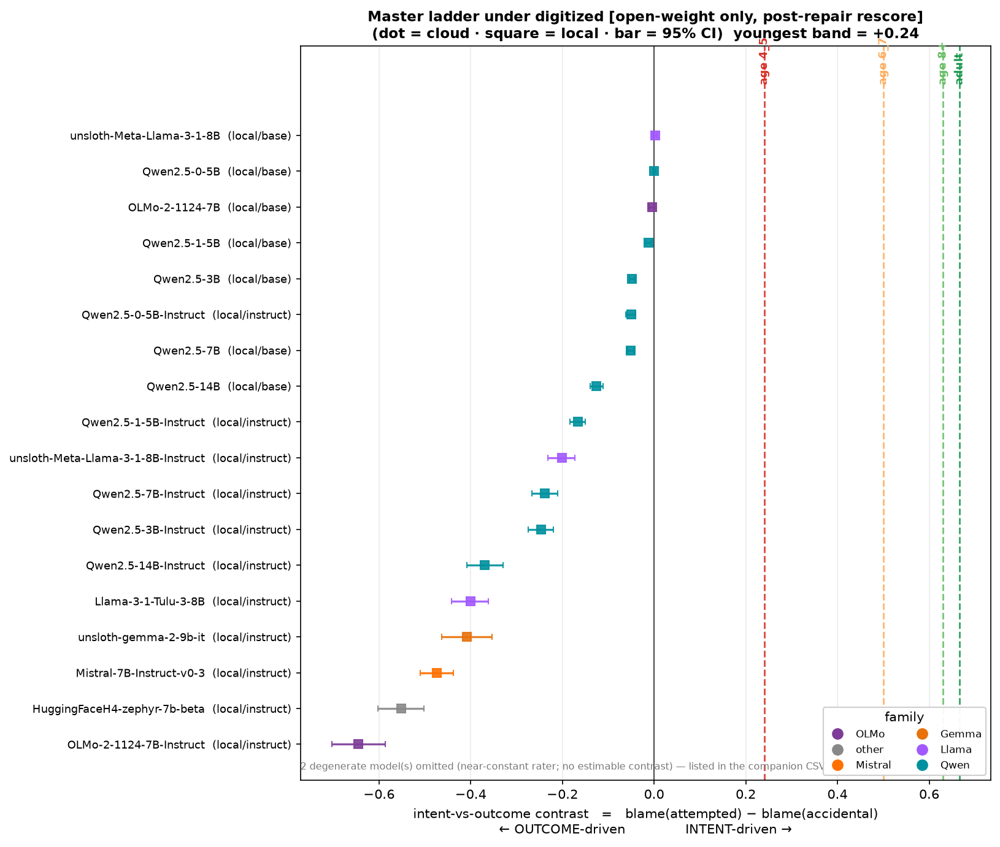
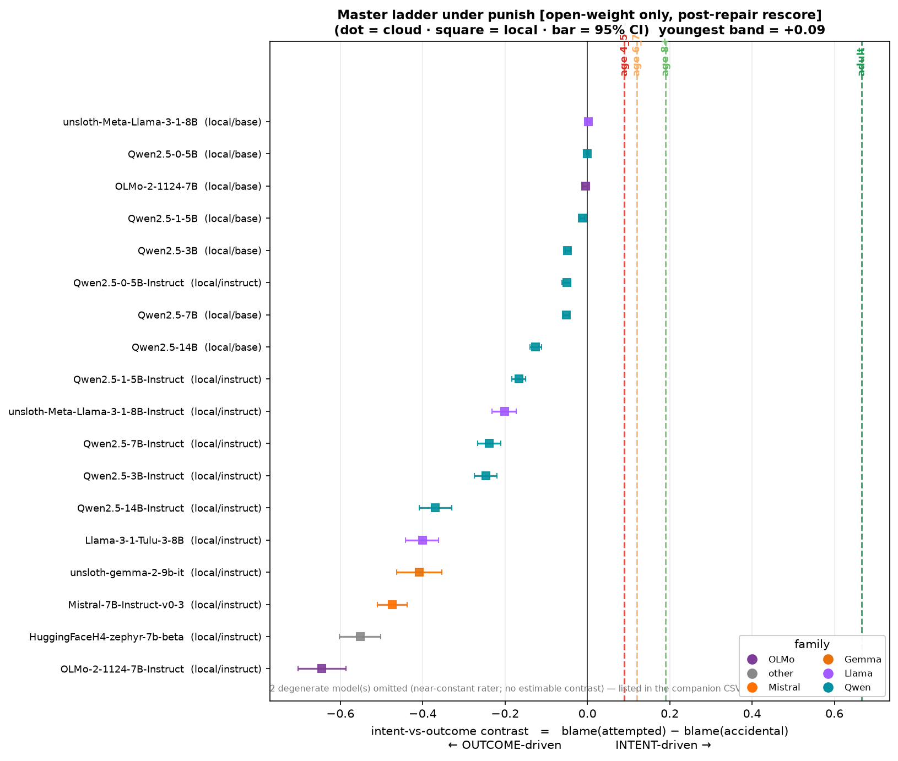
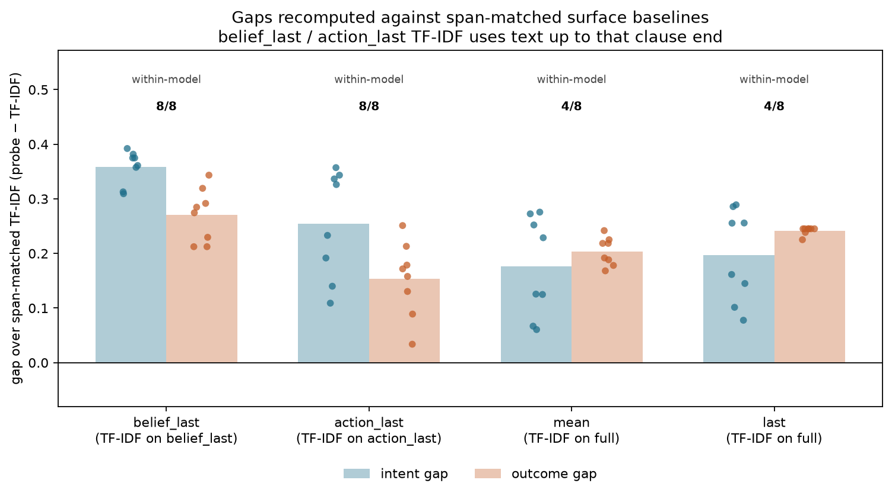
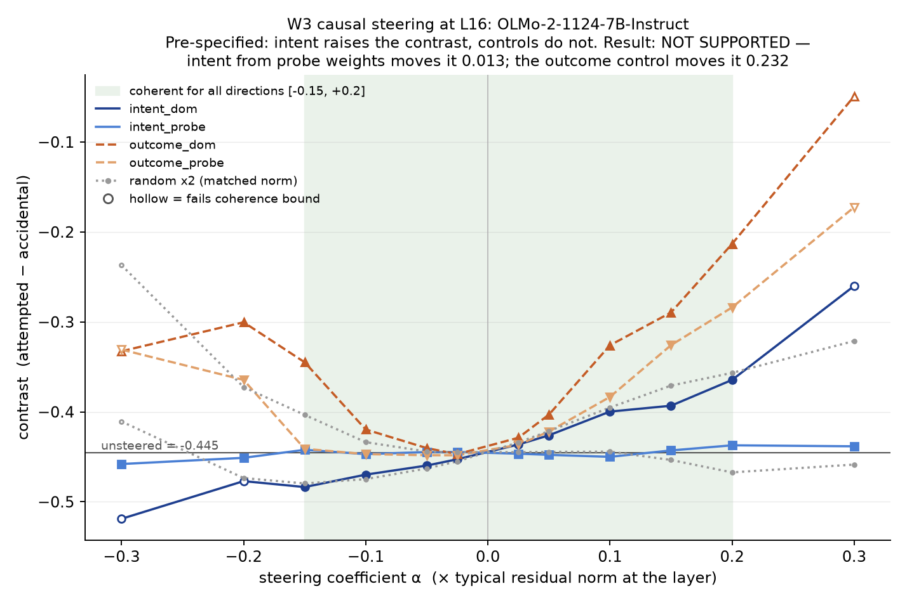
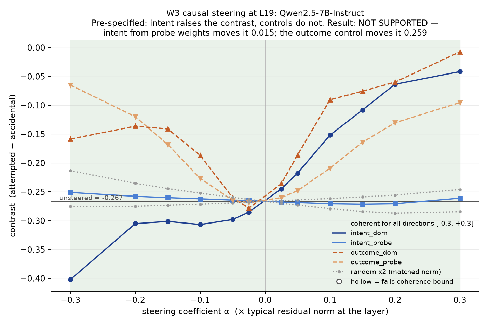

# Mentor packet — moral ToM in LLMs (2026-07-28)

One page of results, then figures. Every number is generated from the artifacts on disk by `code/experiments/49_mentor_packet.py`; regenerate rather than edit.

**One-paragraph version.** Every open-weight model that engages with the rating task passes a standard false-belief benchmark at 0.82-0.99 under its hard (`init_belief=0`) condition, and those same models weight outcome over intent in graded moral judgment, inverting the adult human pattern and falling at or below the youngest measured child band. The bias is induced by post-training: one stage of SFT is sufficient in all three families with published checkpoints, though which stage carries most of the shift is recipe-dependent. Intent is nonetheless linearly decodable from the residual stream at 0.85-0.98, and four tests — three correlational nulls plus a pre-registered steering intervention with a working positive control — say that readable representation is not what drives the judgment.

## 1. The headline: passing a false-belief benchmark does not buy intent-based moral judgment

Same models, two measures. Every model that engages with the rating task at all passes BigToM false belief at **0.815-0.985** and has a moral contrast (attempted - accidental) of **-0.370 to -0.646** — outcome-driven, the inverse of the adult human pattern (+0.67).

| model | type | BigToM false-belief | moral contrast |
|---|---|---:|---:|
| `Qwen_Qwen2_5-14B-Instruct` | instruct | 0.985 | -0.370 |
| `unsloth_gemma-2-9b-it` | instruct | 0.935 | -0.408 |
| `allenai_OLMo-2-1124-7B-Instruct` | instruct | 0.890 | -0.646 |
| `allenai_Llama-3_1-Tulu-3-8B` | instruct | 0.855 | -0.401 |
| `HuggingFaceH4_zephyr-7b-beta` | instruct | 0.835 | -0.551 |
| `mistralai_Mistral-7B-Instruct-v0_3` | instruct | 0.815 | -0.473 |

These are all 6 engaged models (`rating_std` >= 0.2191, the floor derived in `FLOOR_DERIVATION.md`), out of 20 scored (11 instruct). All six are instruct models, and there is no engaged model that passes the benchmark and *also* judges by intent — the cell is empty. BigToM was run with **`init_belief=0`**: the initial-belief sentence is dropped, so the model must infer the belief rather than copy it. Passing under the hard condition is what makes the dissociation strong.

**Framing caution.** The raw correlation across all 20 models (r = -0.26) is confounded: both axes proxy base-vs-instruct, since base models cannot follow the QA format and sit near zero on contrast. The deliverable is this table and the scatter, not a correlation. ToMi is excluded entirely — the scored 400-item slice is 82% non-ToM items (`TOMI_SCORING_AUDIT.md`).

## 2. Where in tuning it happens: SFT is sufficient, the locus is recipe-dependent

**Revised finding — this replaces the earlier "localized to SFT, not RLHF/DPO" claim, which Zephyr refutes.** All three families with published intermediate checkpoints start at a neutral, *engaged* base and move to outcome-weighting. One stage of plain SFT is sufficient everywhere. But the share of the shift SFT contributes is a property of the recipe:

| family | base | SFT | later stages | final | SFT share | concentrates at |
|---|---:|---:|---|---:|---:|---|
| OLMo-2-7B | +0.002 | -0.586 | DPO -0.652 | -0.687 (Instruct) | **85%** | SFT (85%) |
| Tulu-3-8B | +0.007 | -0.258 | DPO -0.395 | -0.398 (RLVR) | **65%** | SFT (65%) |
| Zephyr-7B | -0.001 | -0.150 | — | -0.552 (DPO) | **27%** | DPO (73%) |

Mechanism, in every family at every post-base stage: `b_outcome` grows several times faster than `b_intent` — **3.0-7.7x** across all non-base stages. Report that as a range. The previously quoted "2.5-3.9x" was pre-rescore single-template and is retired.

**Improvement worth flagging.** All three bases are now engaged (`rating_std` OLMo-2-7B 0.058, Tulu-3-8B 0.097, Zephyr-7B 0.029). Tulu-3's base was previously degenerate at 0.018 and Zephyr's whole family was zeros from the digit-token bug. Every family now contrasts a *responsive* near-zero base against its tuned descendants, so the base -> tuned comparison is like-for-like. This was a stated limitation and it is resolved.

## 3. J3: zero of twenty models match the human cell ordering

**0 of 20 models reproduce the human cell ordering (attempted > accidental); 14 are inverted; 6 are tied.** This is the quotable result, not the interaction coefficient — several models approximate the human interaction magnitude (-0.200) while getting the underlying cell pattern backwards.

| | neutral | accidental | attempted | intentional | att - acc | b_interaction |
|---|---:|---:|---:|---:|---:|---:|
| **Humans** (Young 2007) | 0.033 | 0.267 | **0.933** | 0.967 | **+0.666** | -0.200 |
| `allenai/OLMo-2-1124-7B-Instruct` (most inverted) | 0.148 | **0.880** | 0.241 | 0.863 | -0.640 | -0.110 |
| `unsloth/Meta-Llama-3_1-8B-Instruct` (closest coefficient to human) | 0.365 | **0.716** | 0.518 | 0.687 | -0.198 | -0.183 |

Humans judge an attempted harm that caused no damage almost as harshly as a completed intentional one, and an accident far more leniently. These models do the reverse: the accident outranks the attempt. Reading the interaction coefficient alone would call that human-like.

## 4. Four tests, one claim: intent is represented, readable, and not used

Different units of analysis, same conclusion. Present the first two plus the steering result as the load-bearing set; the model-level test is a footnote because n=8 cannot answer anything.

| test | unit | estimate | 95% CI | status |
|---|---|---:|---|---|
| **J2 item-level link** | scenario group within model | slope +0.062 | [-0.146, +0.270] | **informative null** — excludes +0.30 |
| **RSA convergence** | model pair | r = +0.098 | [-0.31, +0.46] | null — same behaviour, different geometry |
| Model-level link | model | r = -0.209 | [-0.80, +0.58] | **uninformative** — footnote only |

**Why J2 is informative rather than merely non-significant.** The minimum theoretically meaningful slope was pre-stated at **+0.30 SD**: if representation drove use, a scenario whose intent is 1 SD more decodable should show at least a medium increase in intent-use. The CI upper bound is **+0.270**, which excludes that threshold. The model-level test spanned [-0.80, +0.58] and excluded nothing — that is the difference.

Robustness, `matched` intent definition (outcome held constant): slope +0.029 [-0.165, +0.223], 424 observations.

**Two limits to state with it.** The bound is on a linear, monotone relation between probe margin and contrast; a threshold relation would not show up. And probe margin measures decodability, not what the model reads out downstream. W3 causal steering is the test that closes that gap.

### The causal test came back, and it agrees with the nulls

**W3 steering (pre-registered, `W3_PRESPEC.md`) failed its own prediction, and the failure is the result.** Steering the intent direction at the peak intent layer does not move the moral contrast more than the outcome-direction control does. The intent direction taken from the *probe weights* — the vector whose decoding accuracy is our representational evidence — barely moves it at all:

| model | unsteered contrast | intent (probe weights) | intent (diff-of-means) | outcome (diff-of-means) | random (matched norm) |
|---|---:|---:|---:|---:|---:|
| OLMo-2-1124-7B-Instruct | -0.445 | **0.013** | 0.081 | 0.232 | 0.124 |
| Qwen2.5-7B-Instruct | -0.267 | **0.015** | 0.225 | 0.259 | 0.053 |

Max |Δcontrast| over all coefficients where the model stays coherent (perplexity within 1.5x, no refusal increase, task compliance 1.00, manual read of 20 generations per level confirming the model still summarises the stories accurately). **The apparatus is not insensitive** — the outcome direction moves the same contrast by up to 0.26 in the same models at the same coefficients, which is the positive control that makes the intent null interpretable. Where the diff-of-means intent direction does move the contrast, it raises all four cells at once, and the accidental cell has least headroom, so the change is ceiling compression rather than a change in intent-weighting. Full verdict: `W3_STEERING_SUMMARY.md`.

So the claim is now carried by four tests rather than three, one of them a manipulation: **intent is represented, linearly readable, and causally inert for this judgment.**

## 5. The human anchor: both ladders, and the choice is not mine to make

**The anchor decision traces to a prior methods pre-specification, not to which number is friendlier.** `dataset/human_reference/methods_child_measure.md` chose Naughty/wrongness, presented-first as primary on **2026-07-10 — sixteen days before** any model was compared against it. Both digitized ladders are reported permanently as a robustness table.

| child series | youngest band (ages 4-5) | models at or below it | status |
|---|---:|---:|---|
| **Naughty, presented-first** | +0.24 | 18/18 | pre-specified primary (2026-07-10) |
| Punish, presented-first | +0.09 | 18/18 | secondary, construct-matched to the `punish_*` prompts |
| Text-reported (pooled prose) | -0.14 | 10/18 | superseded — mixes two constructs the paper separates |

The claim "models fall at or below the youngest measured band" holds under **both digitized measures, including the stricter punishment threshold**, and fails only under the pooled-prose series. That is a robustness result. It does not select the primary anchor — that stays a decision for you.

A theoretical check on the digitization: the punish ladder is monotone in age but flatter than naughtiness (+0.09/+0.12/+0.19 vs +0.24/+0.50/+0.63), which is exactly Cushman et al. (2013)'s two-process prediction that intent constrains wrongness before it constrains deserved punishment. Two independent digitizations reproducing the predicted ordering is evidence the digitization is sound.

Scope note: these counts are open-weight models only. Closed-API models have not been rescored since the stimulus repair and their ladders are emitted separately, marked contaminated-era.

## 6. Six questions for you

> **Provenance flag:** `mentor_meeting_prep.md` is not in the repo, so these are reconstructed from the current results and the earlier four-question list rather than carried over verbatim. Please edit before the meeting.

1. **Primary claim.** Is the paper's primary claim the **behavioral** one (model ladder vs human developmental bands, 18/18 open-weight models at or below the youngest child band under both digitized anchors), with representation as supporting evidence? Or does a strong submission need the causal result (W3) in the main claim?
2. **The anchor.** Naughty/presented-first (+0.24) was pre-specified on 2026-07-10 and the claim holds under it and under the stricter Punish anchor (+0.09). Do you want the primary to stay with the pre-spec, with Punish as permanent robustness?
3. **Recipe-dependence framing.** Zephyr puts 73% of its shift at DPO while OLMo-2 puts 85% at SFT, and Llama-3.1-8B-Instruct moves the *other* way entirely. Should we frame outcome-bias as **a default of many alignment recipes** rather than "instruction tuning causes outcome bias"?
4. **The nulls, now including a causal one.** W3 steering came back negative for intent with a working positive control (outcome direction moves the contrast up to 0.26; probe-weight intent direction moves it 0.016). Is "intent is represented, readable, and causally inert" publishable as a positive contribution on the strength of four converging tests, or do reviewers read a negative steering result as a failed experiment however well controlled?
5. **Roster ceiling.** Our largest model is 14B and half the roster is one family; recent ToM papers standardly test 2-3 frontier APIs plus 8B-70B open weights with Llama-3.3-70B-Instruct as reference. Is the `gemma-3-27b` / `Qwen3-32B` mid-band worth the compute, or do we spend it on W3/W4 depth instead? (`ROSTER_70B_FEASIBILITY.md`)
6. **Degenerate and contaminated rows.** Closed-API models are still v1-contaminated (reported standalone for ToM, never correlated against contrasts), and some open models sit below the engagement floor. Exclude them, or report non-engagement as a finding about rating elicitation?

## 7. Limitations, stated plainly

1. **Zephyr is a counterexample to the SFT-locus claim.** Its shift is 73% at DPO, 27% at SFT. Any statement that the effect is localized to SFT, or absent from RLHF/DPO, is withdrawn. SFT sufficiency survives; SFT primacy does not.
2. **The position dissociation is downgraded from headline to supporting.** The span-matched intent-minus-outcome difference at `belief_last` is **+0.087** (8/8 models, sign test p=0.008) — real but small, and it does not support an "intent represented early, outcome inferred late" reading. A manual audit of five YS2009 stories confirmed the clause offsets are correct but the *setup* sentences before the belief clause already state the hazard, so the probe-over-TF-IDF gap at that position reflects setup content a bag-of-words baseline cannot generalize across scenarios — not outcome anticipation. (`C2_SOURCE_SPLIT_BELIEF_LAST.md`)
3. **Llama-3.1-8B-Instruct does not acquire the bias at all** (base -> instruct delta +0.126, toward intent). The effect is common but not universal.
4. **Only three families publish intermediate checkpoints**, so the stage-level story rests on OLMo-2, Tulu-3 and Zephyr. Everything else is a 2-point base -> instruct delta that cannot speak to locus.
5. **Closed-API models are v1-contaminated.** Their ToM accuracies are reported standalone and never correlated against their contrasts.
6. **The J1 correlation is confounded** by base-vs-instruct on both axes. The per-model table is the deliverable; the all-20 r is a confound demonstration only.
7. **The steering null bounds crude linear steering, not all causal involvement.** W3 adds a fixed vector at one layer across all token positions. A per-position, multi-layer, or `belief_last`-fitted intervention could still find an effect. Also, the intent and outcome difference-of-means directions are not orthogonal (cos ~0.32-0.39), so part of the diff-of-means intent effect may be outcome leakage — which is why the probe-weight null is the cleaner evidence.
8. **The J2 bound is on a linear, monotone relation** between probe margin and contrast; a threshold relation (intent merely present rather than strongly present) would not show up in it.
9. **Model ceiling 14B, roster concentration.** Half the roster is Qwen2.5; no 70B-class model has been run.

## Figures

Copied into `outputs/mentor_packet_figures/`.

### Checkpoint dissection, three families, rescored 7-template basis.

### BigToM false-belief x moral contrast, base/instruct by marker, no regression line.

### J3 interaction per model with 95% CI, human reference marked.

### Human-only ladder: three child series, one shared adult anchor.

### Model ladder against the Naughty (pre-specified primary) child anchor.

### Model ladder against the Punish (secondary, construct-matched) child anchor.

### Probe gaps over span-matched TF-IDF (position dissociation, downgraded to supporting).

### W3 steering, OLMo-2-7B-Instruct: intent direction inside the random-direction noise floor, outcome direction well outside it.

### W3 steering, Qwen2.5-7B-Instruct: same verdict, with the probe-weight intent direction flat across the whole coherent band.

